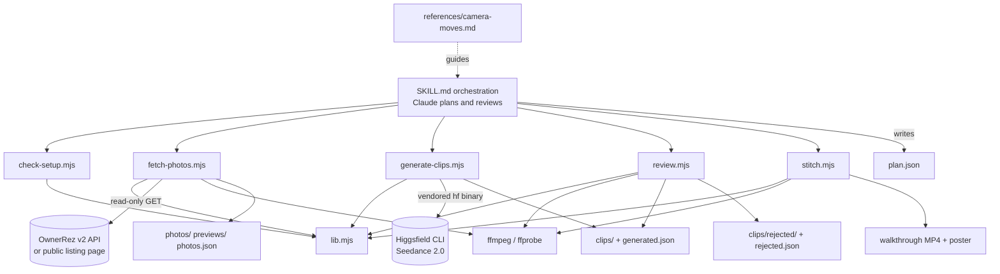

# System architecture

## Overview

The repository is a runnable folder that carries a **project-scoped Claude Code skill** at `.claude/skills/ownerrez-higgsfield-video/`. Cloning it and starting Claude Code in the folder makes the skill available; it can also be copied into a personal skills directory, in which case `.env` and `videos/` are read and written in whatever folder Claude Code is started from.

Inside the skill:

- `SKILL.md`: the orchestration. Four top-priority rules, then seven steps (connect accounts, pull gallery, plan, test clip, generate, review, stitch) and a troubleshooting table. **Claude is the planner and reviewer**; the scripts are deterministic tools it calls.
- `references/camera-moves.md`: how to pick frames, write camera moves and negatives, and read a review grid.
- `scripts/` (Node 18+ ESM, no npm dependencies), one script per stage:
  - `lib.mjs`: shared helpers: argument parsing, `.env` loading (never printed), locating the Higgsfield binary and ffmpeg, a read-only OwnerRez v2 client, and retrying downloads.
  - `check-setup.mjs`: read-only readiness check; ends `READY` / `NOT READY`.
  - `fetch-photos.mjs`: gallery download from API, public page or folder.
  - `generate-clips.mjs`: plan validation, cost estimate, budget-capped generation.
  - `review.mjs`: compare grids, approve / reject.
  - `stitch.mjs`: normalise, crossfade, encode, verify.

The **plan file** (`videos/<property>/plan.json`, written by Claude) and the **generation record** (`clips/generated.json`, written by the scripts) are the contract between the stages.

## Module graph

## Constraints

- **Output stays local and git-ignored.** Everything for a property lands in `videos/<property>/`; `videos/` and `.env` are in `.gitignore`.
- **Read-only against OwnerRez.** The client only issues GETs.
- **A file on disk is not proof.** Only a recorded Higgsfield job id in `generated.json` counts as a generated clip; an unrecorded file in a clip's slot is refused rather than overwritten.
- **Separate ffmpeg passes.** Normalisation and the crossfade chain run separately so a long filter graph does not outlast a shell timeout and a failure points at the clip that caused it (from `stitch.mjs`).
- **Cross-platform process spawning.** Prompts are passed straight to the vendored Higgsfield binary, not through the npm shim, because on Windows the `.cmd` shim needs a shell that mangles prompt quotes and parentheses (from `lib.mjs`).
- **No automated tests** are in the repo; `npm run check` is the setup check, not a test suite.
