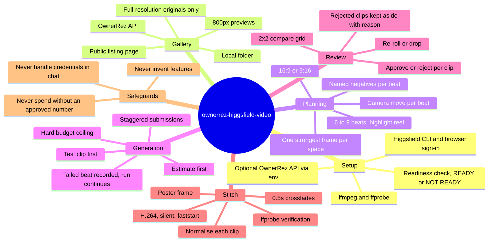

# Feature mindmap

## Feature mindmap

Pages behind the branches: [[camera-moves-stay-inside-the-photo]], [[review-gate-before-stitch]], [[credit-budget-hard-ceiling]], [[gallery-sources-and-originals]], [[credentials-stay-with-the-user]].
