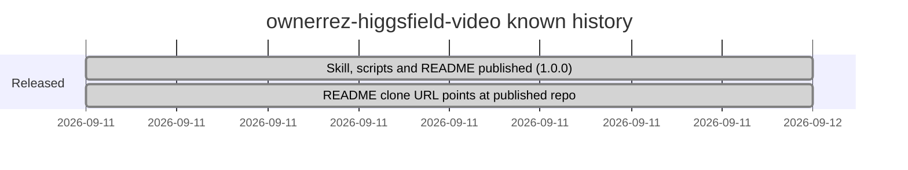

# Roadmap

## Milestones

Git history shows the skill published in one commit on 2026-09-11, followed the same day by a README fix pointing the clone URL at the published repository. `package.json` is at version 1.0.0. No roadmap, changelog or planned features are recorded in the repo.

## Open questions for the owner

- Are further versions planned? Nothing in the repo names one.
- Should the project gain automated tests or CI (none today)?
- The README lists music and on-screen text as out of scope; is that permanent, or deferred?
