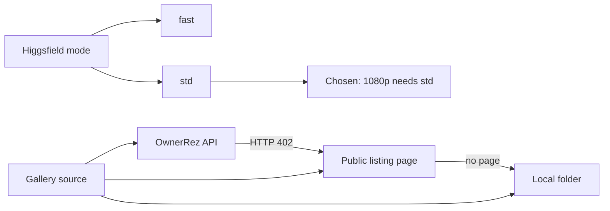

# Tech stack

## Technology choices

| domain | candidates | decision | rationale |
|---|---|---|---|
| Orchestration | Standalone app; Claude Code skill | Project-scoped Claude Code skill (`.claude/skills/…/SKILL.md`) | Frame choice, camera-move writing and clip review need judgment; Claude does those, scripts do the deterministic parts |
| Scripting runtime | Python; Node with npm deps; plain Node | Node 18+ ESM, **no npm dependencies** | Built-in `fetch`, `child_process`, `fs` cover everything; nothing to install beyond Node (`package.json` has no dependencies) |
| Video model | Higgsfield Seedance 2.0, fast or std mode | `seedance_2_0`, **std mode**, audio off | Fast mode cannot do 1080p (from `generate-clips.mjs`) |
| Higgsfield access | npm shim `higgsfield`; vendored `hf` binary | Vendored binary found under the global npm root (override `HIGGSFIELD_BIN`) | On Windows the `.cmd` shim needs a shell, which mangles prompt quotes and parentheses |
| Clip cost | Hardcoded price table; ask the provider | Asked of Higgsfield per duration and cached | Stays correct if pricing changes (from `generate-clips.mjs`) |
| Media tooling | ffmpeg / ffprobe | ffmpeg for previews, compare grids, normalise + xfade + H.264 encode; ffprobe to verify | Standard, scriptable, cross-platform |
| Output format | — | 1920x1080 (or 1080x1920), 24 fps, yuv420p, H.264, faststart, silent | Matches listing-channel delivery notes in `SKILL.md`; silent avoids music-licence rejections |
| Gallery source | OwnerRez v2 API; public page JSON-LD; local folder | All three, in that order of preference | See [[gallery-sources-and-originals]] |
| Credentials | Chat; env file; provider CLI login | Git-ignored `.env` for OwnerRez; Higgsfield CLI's own stored login | See [[credentials-stay-with-the-user]] |
| License | — | MIT | `LICENSE` and `package.json` |

## Decision mindmap

## Open items

- No automated tests or CI are in the repo. Whether to add any (for example around plan validation or the stitch offset maths) is undecided.
- The Higgsfield CLI and model identifiers are external; a change on their side would surface only at run time.
